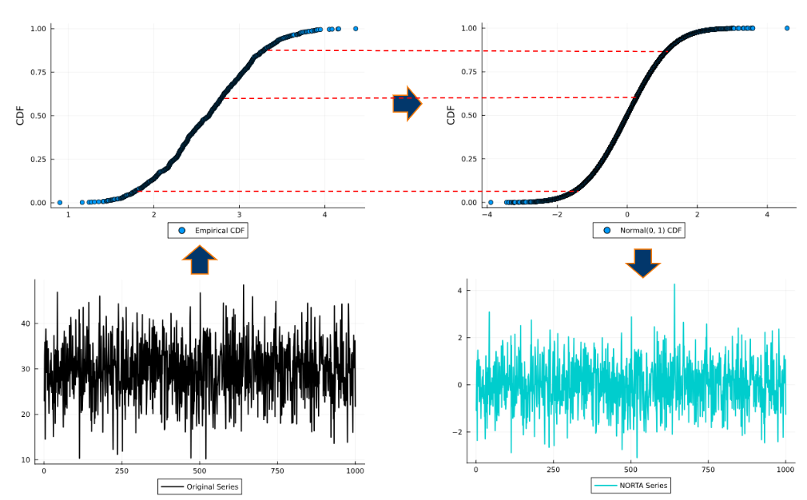
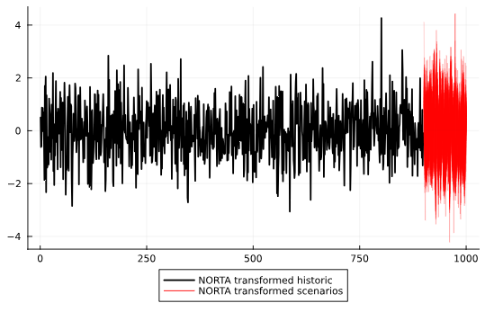
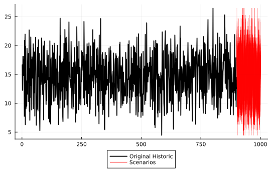

# NonParametricNORTA

| **Build Status** | **Coverage** |
|:-----------------:|:-----------------:|
| [](https://github.com/LAMPSPUC/NonParametricNORTA/actions/workflows/ci.yml) | [](https://codecov.io/gh/LAMPSPUC/NonParametricNORTA) |


NonParametricNORTA.jl is a Julia package designed to implement the concept of Normal to Anything (NORTA) introduced by Marne C. Cario and Barry L. Nelson in their work on "Modeling and Generating Random Vectors with Arbitrary Marginal Distributions and Correlation Matrix." NonParametricNORTA.jl harnesses the power of Julia's framework to offer a novel approach. While staying true to the essence of the original concept, this package diverges by employing non-parametric distribution fitting methods (from KernelDensity.jl package) within the Julia environment. Consequently, it eliminates the necessity for explicit computation of proposed correlation matrices, enhancing the efficiency and flexibility of the process. 

## Data transformation

```julia
using NonParametricNORTA
using Plots

y = rand(1000, 3)*rand(3).*15 #generate y as a regression
y_norta, non_parametric_distribution = NonParametricNORTA.convertData(y) 
```

### Transformation visualization

This transformation involves obtaining the non-parametric distribution's cumulative distribution function (CDF) from the original observations and mapping the equivalent values onto a Normal (0, 1) CDF. Subsequently, these CDF values are adjusted to fit the Normal (0, 1) scale. This transformation process is visually represented in the figure below.



## Data reverse transformation

```julia
sc = NonParametricNORTA.reverseData(rand(Normal(0, 1), 100), non_parametric_distribution)
```
### Reverse transformation visualization

Similar to the initial transformation but in reverse, this process involves reversing the transformed data back to its original scale. When new data is generated, this reverse transformation relies on interpolation and extrapolation techniques.

## Application

In time series simulation processes within stationary contexts, maintaining scenarios that respect historical value bounds becomes crucial. Ensuring scenarios do not violate the maximum and minimum values can be achieved by modeling the transformed NORTA series and then performing the reverse transformation process.

### Regression + residual bootstraping example

```julia
T           = 1000
train_idx   = 1:900
test_idx    = 901:1000
N_scenarios = 100

X = rand(T, 10)
X_train = X[train_idx, :]
X_test  = X[test_idx, :]

y = X*(rand(10).*10) + rand(T)
y_train = y[train_idx]
y_test = y[test_idx]

y_train_norta, np = NonParametricNORTA.convertData(y_train)

β = X_train\y_train_norta #Model the NORTA transformed data
residuals = y_train_norta - X_train*β

NORTA_scenarios = zeros(length(y_test), N_scenarios)
for i in 1:N_scenarios
    NORTA_scenarios[:, i] = X[T_train+1:T, :]*β + rand(residuals, length(y_test))
end
```
#### Transformed data results
```julia
plot(y_train_norta, w=2, color = "black", lab = "NORTA transformed historic", legend=:outerbottom)
for i in 1:N_scenarios
    plot!(vcat(ones(T_train).*NaN, NORTA_scenarios[:, i]), color = "red", alpha = 0.2, lab = "")
end
plot!([], color="red", lab = "NORTA transformed scenarios")
```


The modeled simulation, when visualized in the transformed scale, does not adhere to historical bounds. This is evident as the maximum and minimum of the simulation exceed historical boundaries.

#### Original scale data results
```julia
scenarios = NonParametricNORTA.reverseData(NORTA_scenarios, np)

plot(y_train, w=2, color = "black", lab = "Original Historic", legend=:outerbottom)
for i in 1:N_scenarios
    plot!(vcat(ones(T_train).*NaN, scenarios[:, i]), color = "red", alpha = 0.2, lab = "")
end
plot!([], color="red", lab = "Scenarios")
```


However, upon reverse transforming the scenarios, we observe that the simulation respects the historical boundaries. This demonstrates the utility of the reverse transformation process in maintaining data integrity within the historical context.