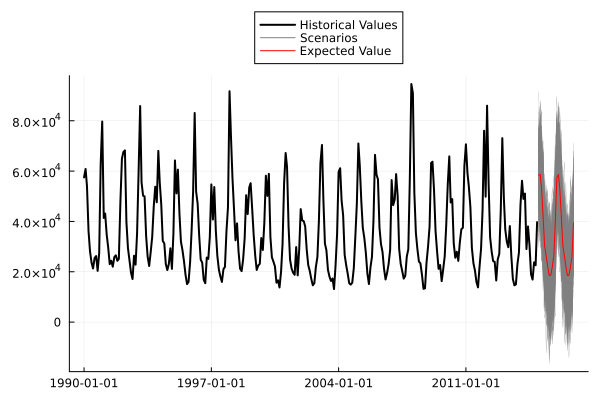
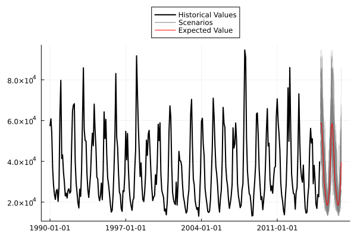

# NonParametricNORTA

| **Build Status** | **Coverage** |
|:-----------------:|:-----------------:|
| [](https://github.com/LAMPSPUC/NonParametricNORTA/actions/workflows/ci.yml) | [](https://codecov.io/gh/LAMPSPUC/NonParametricNORTA.jl) |

NonParametricNORTA.jl is a Julia package designed to implement the concept of Normal to Anything (NORTA) introduced by Marne C. Cario and Barry L. Nelson in their work on "Modeling and Generating Random Vectors with Arbitrary Marginal Distributions and Correlation Matrix." NonParametricNORTA.jl harnesses the power of Julia's framework to offer a novel approach. While staying true to the essence of the original concept, this package diverges by employing non-parametric distribution fitting methods (from KernelDensity.jl package) within the Julia environment. Consequently, it eliminates the necessity for explicit computation of proposed correlation matrices, enhancing the efficiency and flexibility of the process. 

## Data transformation

```julia
using NonParametricNORTA
using Plots
using Distributions

y = rand(1000, 3)*rand(3).*15 #generate y as a regression
y_norta, non_parametric_distribution = NonParametricNORTA.convert_data(y) 
```

### Transformation visualization

This transformation involves obtaining the non-parametric distribution's cumulative distribution function (CDF) from the original observations and mapping the equivalent values onto a Normal (0, 1) CDF. Subsequently, these CDF values are adjusted to fit the Normal (0, 1) scale. This transformation process is visually represented in the figure below.


## Data reverse transformation

```julia
sc = NonParametricNORTA.reverse_data(rand(Normal(0, 1), 100), non_parametric_distribution)
```
### Reverse transformation visualization

Similar to the initial transformation but in reverse, this process involves reversing the transformed data back to its original scale. When new data is generated, this reverse transformation relies on interpolation and extrapolation techniques.

## Application

In time series simulation processes within stationary contexts, maintaining scenarios that respect historical value bounds becomes crucial. Ensuring scenarios do not violate the maximum and minimum values can be achieved by modeling the transformed NORTA series and then performing the reverse transformation process.

### Simulation of Water Inflows

In this study, we aim to generate scenario paths for a time series representing water inflow. We will conduct two simulations employing the Auto ARIMA model, as estimated through the StateSpaceModels.jl package. The first simulation will produce the straightforward output of the model, while the second will incorporate the NORTA transformation to enhance the scenario generation process.

```julia
using StateSpaceModels, CSV, DataFrames, Plots
df = CSV.read("datasets/inflows.csv")

y = df[!, 2]
dates = df[!, 1]
forecast_dates = collect(Date(2015, 1, 1): Month(1): Date(2016, 12, 1))
steps_ahead = 24

```
#### Simulating Original Time Series
```julia
model = auto_arima(y; seasonal = 12)
fit!(model)
scenarios = simulate_scenarios(model, 24, 100)[:, 1, :]
expected_value = [i[1] for i in forecast(model, 24).expected_value]

plt = plot(dates, y, label = "Historical Values", color = :black, w=2, legend=:outertop)
plot!(plt, forecast_dates, scenarios, label = "", color = "grey", width = 0.2)
plot!(forecast_dates, expected_value.*NaN, color = "grey", label="Scenarios")
plot!(forecast_dates, expected_value, lab = "Expected Value", color = :red)

```


The modeled simulation fails to adhere to historical constraints, as demonstrated by the fact that the minimum value of the simulation falls below the established historical bounds.

#### Simulating utilizing NORTA
```julia
transformed_y, non_parametric_distribution = NonParametricNORTA.convert_data(y)

model = auto_arima(transformed_y; seasonal = 12)
fit!(model)
scenarios = simulate_scenarios(model, 24, 100)[:, 1, :]
expected_value = [i[1] for i in forecast(model, 24).expected_value]

scenarios = NonParametricNORTA.reverse_data(scenarios, non_parametric_distribution)
expected_value = NonParametricNORTA.reverse_data(expected_value, non_parametric_distribution)

plt = plot(dates, y, label = "Historical Values", color = :black, w=2, legend=:outertop)
plot!(plt, forecast_dates, scenarios, label = "", color = "grey", width = 0.2)
plot!(forecast_dates, expected_value.*NaN, color = "grey", label="Scenarios")
plot!(forecast_dates, expected_value, lab = "Expected Value", color = :red)

```


As we can see, the use of the NORTA transformation effectively ensures that the simulation remains within historical boundaries.
